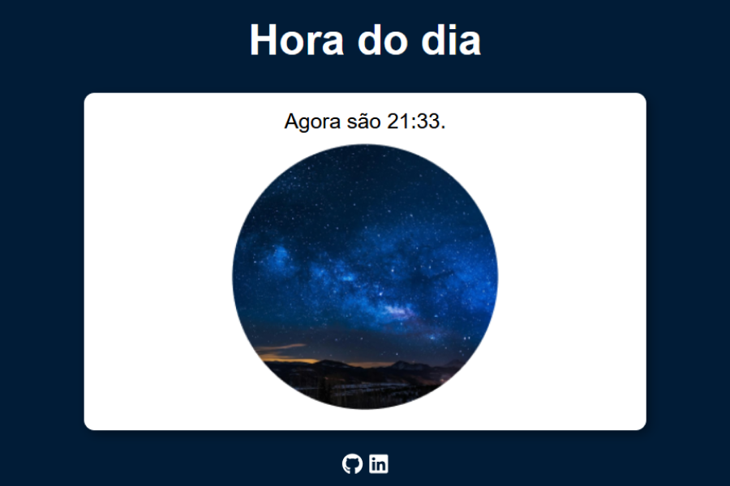

# 🕓 Hora do Dia

Este projeto é uma página interativa que mostra a **hora atual do sistema** e altera o conteúdo da tela de acordo com o período do dia.  
Ele exibe:

- A hora em tempo real
- Uma imagem representando a madrugada, manhã, tarde ou noite
- E muda a **cor de fundo** da página de acordo com o horário 🌅🌇🌃🌙

## 🖼️ Preview

## 🚀 Tecnologias utilizadas

- HTML5
- CSS3
- JavaScript

## 🌐 Acesse o projeto online

🔗 [Clique aqui para visualizar no GitHub Pages](https://aline-mmiranda.github.io/hora-do-dia/)

## 🎯 Objetivo do projeto

> Este projeto foi criado como exercício prático para trabalhar **manipulação do DOM**, **uso da data/hora do sistema**, **condicionais em JavaScript** e mudanças de estilo dinâmicas.  
> Também foi uma forma de entender como tornar páginas mais **interativas** e visuais com base em dados em tempo real.

## ✨ Autora

Feito com carinho por **Aline M Miranda**  
👩‍💻 Estudante de programação | 🐶 Mãe da Zeiss | 🌙 Libriana em transição de carreira

## 📌 Observações

> O projeto pode ser expandido futuramente para mostrar a data completa, saudação personalizada ou integração com temas do sistema. Feedbacks são sempre bem-vindos! 💬💜
